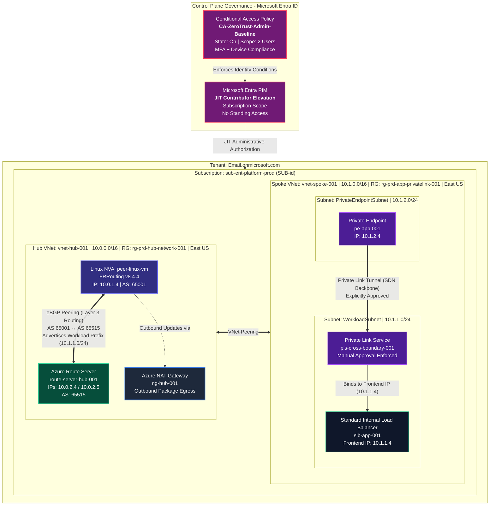

# Zero-Trust Enterprise Landing Zone: Dynamic BGP Routing & Identity Governance

> **Architecture Philosophy:** *SC-100 designed the security controls; AZ-700 built the underlying network fabric. This repository demonstrates the convergence of Control Plane Security and Data Plane Infrastructure in a single production environment.*

---

## 📋 Executive Summary

This repository documents the complete deployment lifecycle, configuration standards, and CLI/PowerShell verification for an enterprise-grade **Zero-Trust Azure Landing Zone**.

The architecture enforces **Control Plane Security** (Microsoft Entra PIM JIT elevation and Conditional Access baselines) alongside **Data Plane Isolation** (eBGP dynamic routing via FRRouting v8.4.4 on Linux, Azure Route Server, Internal Load Balancers, and Cross-Boundary Private Link Services).

---

## 🏗 System Architecture Diagram



---

## ⚡ Key Architecture Highlights

- **Real eBGP Convergence:** Established bidirectional eBGP route propagation between a Linux VM running FRRouting v8.4.4 (`AS 65001`) and Azure Route Server (`AS 65515`). Dynamic route propagation verified live via FRRouting `vtysh` and Azure PowerShell.
- **FRRouting Engine Tuning:** Overcame FRR 8.4+ default route suppression by injecting a static Null0 RIB entry for the workload prefix (`10.1.1.0/24`), disabling `ebgp-requires-policy`, and binding explicit `PERMIT-ALL` outbound route maps.
- **Zero-Public-IP NVA Egress:** Provisioned an Azure NAT Gateway (`ng-hub-001`) on `HubSubnet` to allow the NVA to pull package updates (`sudo apt install frr`) securely without exposing a Public IP or SSH port directly to the internet.
- **Cross-Boundary Private Link Isolation:** Deployed `pls-cross-boundary-001` attached to an Internal Load Balancer (`slb-app-001`, `10.1.1.4`). Enforced manual connection approvals for consumer Private Endpoints (`pe-app-001`, `10.1.2.4`) in `PrivateEndpointSubnet`.
- **Zero-Trust Identity Baseline:** Enforced Conditional Access (`CA-ZeroTrust-Admin-Baseline`) requiring simultaneous MFA and Intune device compliance.
-  Configured Entra PIM JIT Contributor elevation at the subscription scope (`sub-ent-platform-prod`), eliminating standing privileges.

---

## 🚀 Implementation Phases

### Phase 1: Governance & Subscription Placement
Established management hierarchy and registered enterprise subscription metadata to enforce governance boundaries prior to infrastructure deployment.
1. Moved `sub-ent-platform-prod` into `mg-prod` under `mg-workloads`.
2. Provisioned core resource groups (`rg-prd-hub-network-001` and `rg-prd-app-privatelink-001`) in `East US`.
3. Programmatically assigned mandatory governance tags (`Environment`, `Project`, `Owner`, `CostCenter`, `SecurityLevel`) across resource groups.

---

### Phase 2: Core Hub-and-Spoke VNet Topology
Constructed network boundaries and prepared subnet partitioning for dynamic routing and private endpoints.
1. **Hub Network:** Provisioned `vnet-hub-001` (`10.0.0.0/16`) in `rg-prd-hub-network-001` containing `HubSubnet` (`10.0.1.0/24`), `RouteServerSubnet` (`10.0.2.0/24`), and `AzureFirewallSubnet` (`10.0.3.0/24`).
2. **Spoke Network:** Provisioned `vnet-spoke-001` (`10.1.0.0/16`) in `rg-prd-app-privatelink-001` containing `WorkloadSubnet` (`10.1.1.0/24`) and `PrivateEndpointSubnet` (`10.1.2.0/24`).
3. **VNet Peering:** Established bidirectional VNet peering between `vnet-hub-001` and `vnet-spoke-001`.

---

### Phase 3: Dynamic BGP Routing via FRRouting & Azure Route Server
Deployed `route-server-hub-001` (`AS 65515`) to enable dynamic prefix exchange with `peer-linux-vm` (`AS 65001`) without static UDR maintenance. Outbound connectivity for package installation was handled securely via Azure NAT Gateway (`ng-hub-001`).

#### FRRouting (`vtysh`) Engine Configuration
```text
configure terminal
!
ip route 10.1.1.0/24 Null0
!
route-map PERMIT-ALL permit 10
exit
!
router bgp 65001
 neighbor 10.0.2.4 remote-as 65515
 neighbor 10.0.2.4 route-map PERMIT-ALL out
 neighbor 10.0.2.5 remote-as 65515
 neighbor 10.0.2.5 route-map PERMIT-ALL out
 network 10.1.1.0/24
 no bgp ebgp-requires-policy
end
write memory
clear ip bgp 10.0.2.4 soft out
clear ip bgp 10.0.2.5 soft out
```

---

### Phase 4: Cross-Boundary Private Link Service & Endpoint Isolation
Isolated backend application tiers using cross-boundary Private Endpoints.
1. Deployed standard Internal Load Balancer `slb-app-001` (`10.1.1.4`) in `WorkloadSubnet` (`10.1.1.0/24`).
2. Configured Private Link Service `pls-cross-boundary-001` linked to `slb-app-001` with explicit NAT subnets and restricted subscription visibility.
3. Provisioned Private Endpoint `pe-app-001` (`10.1.2.4`) in `PrivateEndpointSubnet` (`10.1.2.0/24`) and executed the manual connection approval workflow.

---

### Phase 5: Zero-Trust Identity Governance & Access Hardening
Enforced control plane access boundaries on Microsoft Entra ID.
1. **Microsoft Entra PIM:** Configured Just-In-Time (JIT) Contributor role elevation for `sub-ent-platform-prod` requiring justification and MFA.
2. **Conditional Access:** Deployed policy `CA-ZeroTrust-Admin-Baseline` enforcing phishing-resistant MFA and compliant device state for administrative control plane access.

---

## 🔬 Technical Verification & Evidence

### 1. FRRouting Outbound Advertised Routes (`vtysh`)
Executing `show ip bgp neighbors 10.0.2.4 advertised-routes` on `peer-linux-vm` confirms prefix export to Azure Route Server instance 0 (`10.0.2.4`):

```text
peer-linux-vm# show ip bgp neighbors 10.0.2.4 advertised-routes
BGP table version is 1, local router ID is 10.0.1.4, vrf id 0
Default local pref 100, local AS 65001
Status codes:  s suppressed, d damped, h history, * valid, > best, = multipath,
               i internal, r RIB-failure, S Stale, R Removed

    Network          Next Hop          Metric LocPrf Weight Path
*> 10.1.1.0/24      0.0.0.0                  0          32768 i

Total number of prefixes 1
```

### 2. Azure Route Server Control Plane Verification (PowerShell)
Querying `route-server-hub-001` via Azure PowerShell confirms installed routes across redundant instances (`10.0.2.4` and `10.0.2.5`).

```powershell
Get-AzRouteServerPeerLearnedRoute `
  -ResourceGroupName "rg-prd-hub-network-001" `
  -RouteServerName "route-server-hub-001" `
  -PeerName "peer-linux-vm"
```

```text
LocalAddress Network     NextHop  SourcePeer Origin AsPath Weight
------------ -------     -------  ---------- ------ ------ ------
10.0.2.5     10.1.1.0/24 10.0.1.4 10.0.1.4   EBgp   65001  32768 
10.0.2.4     10.1.1.0/24 10.0.1.4 10.0.1.4   EBgp   65001  32768
```

---


## 📸 Infrastructure Verification Images

### *[Phase 1: Governance & Management Hierarchy](../azure-ebgp-pim-landing-zone/docs/phase-1-governance/README.md)*
| Resource | Verification Description | Evidence Link |
|---|---|---|
| Management Hierarchy | `sub-ent-platform-prod` placed inside `mg-prod` | [View Evidence](docs/images/phase-1/01-mg-hierarchy.png) |
| Subscription Tags | 5 mandatory metadata tags applied to RG scope | [View Evidence](docs/images/phase-1/02-subscription-tags.png) |

---

### *[Phase 2: Core Network Fabric](../azure-ebgp-pim-landing-zone/docs/phase-2-network-fabric/README.md)*
| Resource | Verification Description | Evidence Link |
|---|---|---|
| Subnet Configuration | `vnet-hub-001` subnet partitioning (`RouteServerSubnet`, etc.) | [View Evidence](docs/images/phase-2/03-vnet-subnets.png) |
| VNet Peering | Bidirectional `Connected` status between Hub and Spoke | [View Evidence](docs/images/phase-2/04-vnet-peering.png) |

---

### *[Phase 3: Dynamic BGP Routing](../azure-ebgp-pim-landing-zone/docs/phase-3-bgp-frrouting/README.md)*
| Resource | Verification Description | Evidence Link |
|---|---|---|
| Azure Route Server | `route-server-hub-001` overview showing ASN `65515` | [View Evidence](docs/images/phase-3/01-routeserver-overview.png) |
| BGP Peers | Peers tab confirming connected state for `peer-linux-vm` (`10.0.1.4`) | [View Evidence](docs/images/phase-3/02-bgp-peers-connected.png) |

---

### *[Phase 4: Cross-Boundary Private Link Service](../azure-ebgp-pim-landing-zone/docs/phase-4-private-link/README.md)*
| Resource | Verification Description | Evidence Link |
|---|---|---|
| Private Link Service | `pls-cross-boundary-001` alias and NAT subnet mapping | [View Evidence](docs/images/phase-4/01-privatelink-service.png) |
| Endpoint Connection | Approved state for `pe-app-001` (`10.1.2.4`) | [View Evidence](docs/images/phase-4/02-private-endpoint-approved.png) |

---

### *[Phase 5: Identity Governance & Access Hardening](../azure-ebgp-pim-landing-zone/docs/phase-5-identity-governance/README.md)*
| Resource | Verification Description | Evidence Link |
|---|---|---|
| Entra PIM | Eligible Contributor assignment on `sub-ent-platform-prod` | [View Evidence](docs/images/phase-5/01-pim-eligible-assignments.png) |
| Conditional Access | `CA-ZeroTrust-Admin-Baseline` policy enforcement details | [View Evidence](docs/images/phase-5/02-conditional-access-policy.png) |
---

## 📁 Repository Directory Structure

```text
azure-ebgp-pim-landingzone/
├── README.md                                   (top-level: overview, diagrams, evidence)
├── LICENSE
├── .gitignore
├── docs/
│   ├── phase-1-governance/README.md            (Management Groups & Subscription tagging)
│   ├── phase-2-network-fabric/README.md        (Hub-Spoke VNets, Subnets & VNet Peering)
│   ├── phase-3-dynamic-routing/README.md       (Linux FRR v8.4.4 & Azure Route Server integration)
│   ├── phase-4-private-link/README.md          (Internal Load Balancers, PLS & Private Endpoints)
│   ├── phase-5-identity-governance/README.md   (Entra PIM JIT & Conditional Access policies)
│   └── images/
│       ├── phase-1/
│       ├── phase-2/
│       ├── phase-3/
│       ├── phase-4/
│       └── phase-5/
├── scripts/
   ├── phase-1/                                (Governance & tagging setup scripts)
   ├── phase-2/                                (Network fabric & peering deployment scripts)
   ├── phase-3/                                (FRRouting vtysh & BGP configuration scripts)
   └── phase-4/                                (Private Link Service & Endpoint deployment scripts)

```