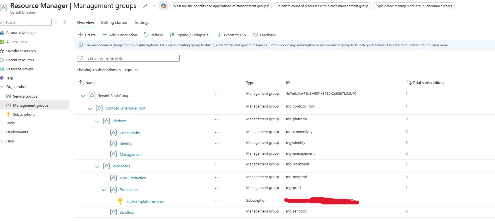
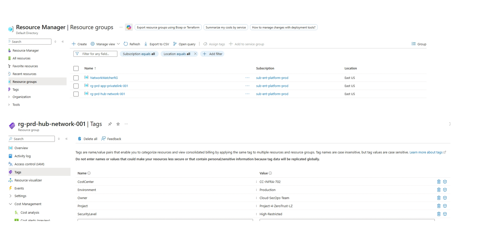

# Phase 1: Governance & Subscription Placement

> **Phase Objective:** Establish control plane governance, subscription management hierarchy, and mandatory metadata tagging prior to resource deployment.

---

##  Phase Overview

Phase 1 establishes the foundational management boundaries for the **Zero-Trust Enterprise Landing Zone**. By positioning the target subscription into a dedicated production Management Group and programmatically enforcing standardized governance tags across resource groups, all downstream infrastructure inherits administrative compliance and audit visibility.

---

##  Key Technical Deliverables & Specifications

- **Target Location:** `East US`
- **Tenant Scope:** `Email.onmicrosoft.com`
- **Subscription Scope:** `sub-ent-platform-prod` (`Sub-id`)
- **Management Group Placement:** Root → `mg-workloads` → `mg-prod`
- **Allocated Network CIDR Ranges:**
  - **Hub VNet (`vnet-hub-001`):** `10.0.0.0/16`
  - **Spoke VNet (`vnet-spoke-001`):** `10.1.0.0/16`

---

##  Implementation Steps

### 1. Management Group Hierarchy Alignment
Moved `sub-ent-platform-prod` under the `mg-prod` management group to ensure RBAC and Policy enforcement flow down automatically.

### 2. Core Resource Group Provisioning
Created the required deployment boundaries in `East US`:
- `rg-prd-hub-network-001` — Hosts Hub VNet (`10.0.0.0/16`), Azure Route Server, NAT Gateway, and NVA.
- `rg-prd-app-privatelink-001` — Hosts Spoke VNet (`10.1.0.0/16`), Workload Subnet, ILB, and Private Link Services.

### 3. Governance Tag Enforcements
Programmatically applied standard enterprise metadata tags across all resource groups:

| Tag Key | Assigned Value | Description / Purpose |
|---|---|---|
| `Environment` | `Production` | Deployment lifecycle classification |
| `Project` | `Project-4-ZeroTrust-LZ` | Associated architectural initiative |
| `Owner` | `Cloud-Secops-Team` | Administrative accountability owner |
| `CostCenter` | `CC-INFRA-702` | Financial billing allocation key |
| `SecurityLevel` | `High-Restricted` | Data classification & policy baseline level |

---

##  Evidence & Verification

All evidence images are linked using relative paths to match the root directory structure:

### 1. Management Group Placement
Verification of `sub-ent-platform-prod` (`Sub-id`) assigned under `mg-prod`.

### 2. Resource Group & Metadata Tag Verification
Verification of mandatory governance tags (`Environment`, `Project`, `Owner`, `CostCenter`, `SecurityLevel`) applied to `rg-prd-hub-network-001` and `rg-prd-app-privatelink-001` in `East US`.

