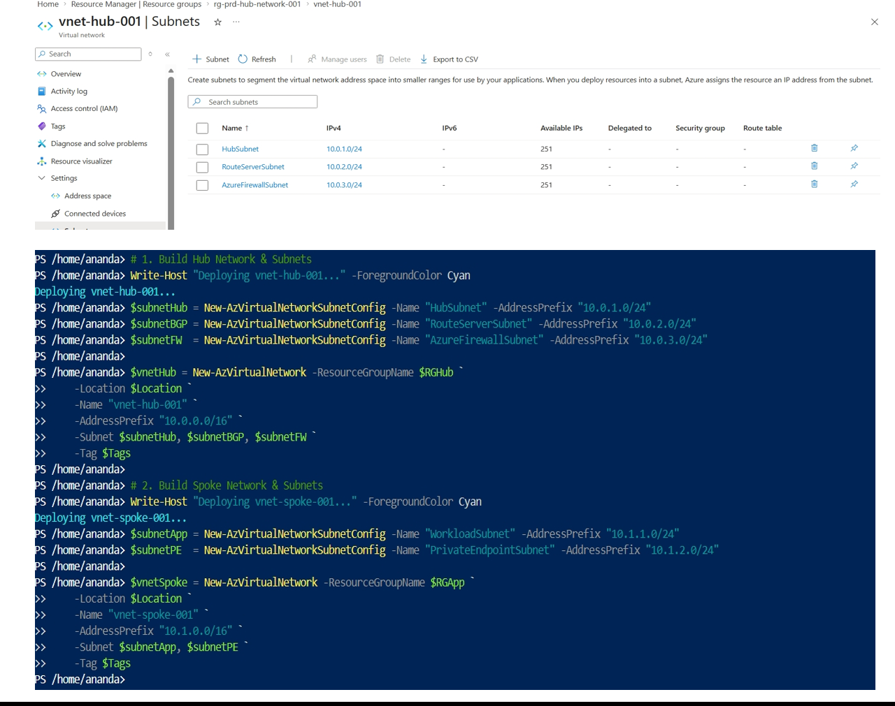
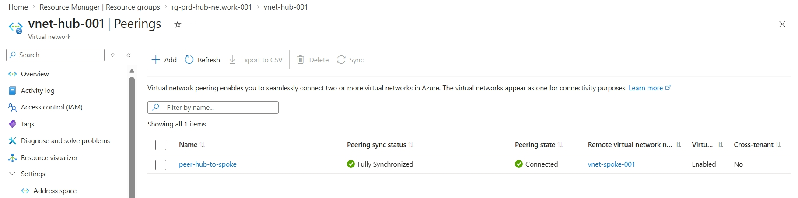

# Phase 2: Core Hub-and-Spoke VNet Topology

> **Phase Objective:** Construct the core network fabric, establish Hub-and-Spoke VNet peering, and partition subnets for dynamic routing, firewalling, and workload workloads.

---

##  Phase Overview

Phase 2 builds the **Data Plane Network Backbone** for the Zero-Trust Landing Zone in `East US`. It establishes `vnet-hub-001` (`10.0.0.0/16`) and `vnet-spoke-001` (`10.1.0.0/16`), partitions dedicated platform subnets, and configures bidirectional VNet peering to enable secure inter-VNet routing.

---

##  Key Technical Deliverables & Specifications

- **Target Region:** `eastus`
- **Subscription Scope:** `sub-ent-platform-prod` (`Sub-id`)
- **Hub Virtual Network (`vnet-hub-001`):**
  - **Resource Group:** `rg-prd-hub-network-001`
  - **Address Space:** `10.0.0.0/16`
  - **Subnets:**
    - `HubSubnet` — `10.0.1.0/24` (Linux NVA / Peer VM)
    - `RouteServerSubnet` — `10.0.2.0/24` (Azure Route Server control plane)
    - `AzureFirewallSubnet` — `10.0.3.0/24` (Perimeter security)
- **Spoke Virtual Network (`vnet-spoke-001`):**
  - **Resource Group:** `rg-prd-app-privatelink-001`
  - **Address Space:** `10.1.0.0/16`
  - **Subnets:**
    - `WorkloadSubnet` — `10.1.1.0/24` (Backend application tier & ILB)
    - `PrivateEndpointSubnet` — `10.1.2.0/24` (Private Endpoints)

---

##  Network Fabric Architecture

| Virtual Network | Subnet Name | CIDR Prefix | Resource Group | Purpose / Usage |
|---|---|---|---|---|
| **`vnet-hub-001`** | `HubSubnet` | `10.0.1.0/24` | `rg-prd-hub-network-001` | Linux NVA (`peer-linux-vm`) |
| | `RouteServerSubnet` | `10.0.2.0/24` | `rg-prd-hub-network-001` | Azure Route Server (`AS 65515`) |
| | `AzureFirewallSubnet` | `10.0.3.0/24` | `rg-prd-hub-network-001` | Perimeter Azure Firewall |
| **`vnet-spoke-001`** | `WorkloadSubnet` | `10.1.1.0/24` | `rg-prd-app-privatelink-001` | Workload compute & ILB (`10.1.1.4`) |
| | `PrivateEndpointSubnet` | `10.1.2.0/24` | `rg-prd-app-privatelink-001` | Private Endpoints (`10.1.2.4`) |

---

##  Implementation Steps

### 1. Hub VNet & Subnet Provisioning
Provisioned `vnet-hub-001` (`10.0.0.0/16`) inside `rg-prd-hub-network-001` with pre-allocated subnets (`HubSubnet`, `RouteServerSubnet`, and `AzureFirewallSubnet`). `RouteServerSubnet` adheres strictly to Microsoft's required casing for Azure Route Server integration in Phase 3.

### 2. Spoke VNet & Subnet Provisioning
Provisioned `vnet-spoke-001` (`10.1.0.0/16`) inside `rg-prd-app-privatelink-001` with partitioned subnets (`WorkloadSubnet` and `PrivateEndpointSubnet`).

### 3. Bidirectional VNet Peering
Established bidirectional VNet peering (`peer-hub-to-spoke` and `peer-spoke-to-hub`) between `vnet-hub-001` and `vnet-spoke-001` with transit options enabled.

---

##  Evidence & Verification

All evidence screenshots are stored in `docs/images/phase-2/`:

### 1. Subnet Partitioning Verification
Verification of `vnet-hub-001` subnets (`HubSubnet`, `RouteServerSubnet`, `AzureFirewallSubnet`) and `vnet-spoke-001` subnets (`WorkloadSubnet`, `PrivateEndpointSubnet`).

### 2. Bidirectional VNet Peering State
Verification of `Connected` status for `peer-hub-to-spoke` and `peer-spoke-to-hub`.

---

## 💡 Lessons Learned & Operational Notes

- **Exact Subnet Naming:** `RouteServerSubnet` and `AzureFirewallSubnet` must match Azure platform casing rules exactly; otherwise, subsequent deployment of Azure Route Server or Azure Firewall fails.
- **PowerShell Backtick Line Continuation:** When executing multi-line `New-AzVirtualNetwork` commands in CloudShell, ensure backticks (`` ` ``) have no trailing whitespace.
- **Image File Paths:** Kept image paths aligned to `docs/images/phase-2/*.png` to guarantee clean rendering without 404 dead links across the repository.