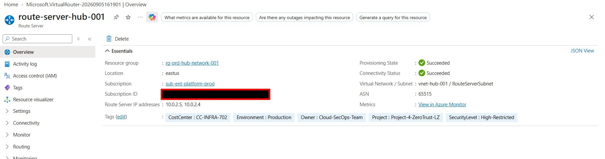
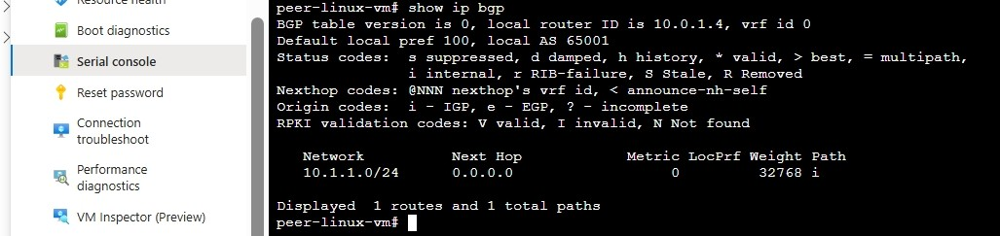
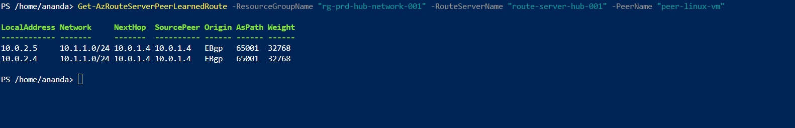

# Phase 3: Dynamic BGP Routing via FRRouting & Azure Route Server

> **Phase Objective:** Deploy an Azure Route Server and a Linux NVA running FRRouting (FRR) v8.4.4 to establish dynamic eBGP route propagation across the Hub-and-Spoke fabric without static UDR maintenance.

---

## 📋 Phase Overview

Phase 3 establishes the **Control Plane Routing Layer** for the enterprise landing zone. By pairing `route-server-hub-001` (`AS 65515`) with `peer-linux-vm` (`AS 65001`), dynamic routes advertised by the Linux NVA are automatically injected into the Azure SDN fabric. Outbound internet connectivity for package installations (`sudo apt install frr`) is handled securely using an Azure NAT Gateway (`ng-hub-001`), preserving zero-public-IP isolation.

---

## ⚡ Key Technical Deliverables & Specifications

- **Target Region:** `eastus`
- **Subscription Scope:** `sub-ent-platform-prod` (`41a2b403-5b13-4a58-8cc0-c3ec75dba78a`)
- **Azure Route Server:**
  - **Resource Name:** `route-server-hub-001`
  - **Subnet Placement:** `RouteServerSubnet` (`10.0.2.0/24`) inside `vnet-hub-001`
  - **BGP Autonomous System Number (ASN):** `65515`
  - **Route Server Instances:** `10.0.2.4` (Peer 0) & `10.0.2.5` (Peer 1)
- **Linux NVA / Peer VM:**
  - **Resource Name:** `peer-linux-vm`
  - **Subnet Placement:** `HubSubnet` (`10.0.1.0/24`) inside `vnet-hub-001`
  - **Private IP Address:** `10.0.1.4`
  - **BGP Autonomous System Number (ASN):** `65001`
  - **Software Stack:** Ubuntu 22.04 LTS with FRRouting (FRR v8.4.4)
- **Outbound Egress:**
  - **Resource Name:** `ng-hub-001` (Azure NAT Gateway attached to `HubSubnet`)
- **Advertised Workload Prefix:** `10.1.1.0/24` (Spoke `WorkloadSubnet`)

---

## 🏗 Dynamic Routing Architecture

| Component | Resource Identifier / IP | Details / BGP Role | Location | Resource Group |
|---|---|---|---|---|
| **Azure Route Server** | `route-server-hub-001` | ASN `65515` | `eastus` | `rg-prd-hub-network-001` |
| **ARS Instance 0** | `10.0.2.4` | Primary BGP Peer | `eastus` | `rg-prd-hub-network-001` |
| **ARS Instance 1** | `10.0.2.5` | Secondary BGP Peer | `eastus` | `rg-prd-hub-network-001` |
| **Linux NVA VM** | `peer-linux-vm` | Ubuntu 22.04 LTS (Zero Public IP) | `eastus` | `rg-prd-hub-network-001`|
| **Linux NVA Interface** | `10.0.1.4` | `HubSubnet` (`10.0.1.0/24`) | `eastus` | `rg-prd-hub-network-001` |
| **Linux NVA BGP AS** | ASN `65001` | eBGP Peer to Route Server | `eastus` | `rg-prd-hub-network-001` |
| **NAT Gateway** | `ng-hub-001` | Egress for package updates | `eastus` | `rg-prd-hub-network-001` |
| **Advertised Prefix** | `10.1.1.0/24` | Workload Subnet Route | `eastus` | `rg-prd-app-privatelink-001` |

---

## 🚀 Implementation Steps

### 1. Route Server & Egress Gateway Deployment
Provisioned `route-server-hub-001` inside `RouteServerSubnet` (`10.0.2.0/24`). Attached `ng-hub-001` (Azure NAT Gateway) to `HubSubnet` (`10.0.1.0/24`) to give `peer-linux-vm` outbound internet access for packages without exposing inbound public IP endpoints.

### 2. Linux NVA Bootstrap & FRR Installation
Accessed `peer-linux-vm` using private management connectivity, updated package indices via the NAT Gateway, and enabled the FRR BGP daemon:

```bash
# System update & FRRouting installation via Azure NAT Gateway
sudo apt update && sudo apt install -y frr frr-pythontools

# Enable BGP daemon in FRR configuration
sudo sed -i 's/bgpd=no/bgpd=yes/g' /etc/frr/daemons
sudo systemctl restart frr
```

### 3. FRRouting (`vtysh`) BGP Engine Tuning
Overcame FRR 8.4+ route suppression by injecting a static Null0 RIB entry for `10.1.1.0/24`, disabling `ebgp-requires-policy`, and binding explicit `PERMIT-ALL` outbound route maps:

```text
configure terminal
!
ip route 10.1.1.0/24 Null0
!
route-map PERMIT-ALL permit 10
exit
!
router bgp 65001
 neighbor 10.0.2.4 remote-as 65515
 neighbor 10.0.2.4 route-map PERMIT-ALL out
 neighbor 10.0.2.5 remote-as 65515
 neighbor 10.0.2.5 route-map PERMIT-ALL out
 network 10.1.1.0/24
 no bgp ebgp-requires-policy
end
write memory
clear ip bgp 10.0.2.4 soft out
clear ip bgp 10.0.2.5 soft out
```

### 4. Azure Route Server BGP Peer Registration
Registered `peer-linux-vm` (`10.0.1.4`, ASN `65001`) as an explicit BGP Peer within `route-server-hub-001` to authorize dynamic route exchanges.

---

## 🔬 Evidence & Verification

### 1. Azure Route Server Overview & Peer Registration
Verification of `route-server-hub-001` (`AS 65515`) deployed in `RouteServerSubnet` (`10.0.2.0/24`) with `peer-linux-vm` (`10.0.1.4`, ASN `65001`) attached in `Connected` state.




### 2. FRRouting BGP Engine Neighbor Verification
Verification of active eBGP peering sessions from `peer-linux-vm` (`10.0.1.4`) to Azure Route Server instances (`10.0.2.4` and `10.0.2.5`).

---

```text
peer-linux-vm# show ip bgp summary

IPv4 Unicast Summary (VRF default):
BGP router identifier 10.0.1.4, local AS number 65001 vrf-id 0
BGP table version 0
RIB entries 1, using 192 bytes of memory
Peers 2, using 1448 KiB of memory

Neighbor        V         AS   MsgRcvd   MsgSent   TblVer  InQ OutQ  Up/Down Sta
te/PfxRcd    PfxSnt Desc
10.0.2.4        4      65515       650       570        0    0    0 09:28:40
  (Policy)  (Policy) N/A
10.0.2.5        4      65515       652       570        0    0    0 09:28:35
  (Policy)  (Policy) N/A

Total number of neighbors 2
```
---
```text

peer-linux-vm# show ip bgp
BGP table version is 0, local router ID is 10.0.1.4, vrf id 0
Default local pref 100, local AS 65001
Status codes:  s suppressed, d damped, h history, * valid, > best, = multipath,
               i internal, r RIB-failure, S Stale, R Removed
Nexthop codes: @NNN nexthop's vrf id, < announce-nh-self
Origin codes:  i - IGP, e - EGP, ? - incomplete
RPKI validation codes: V valid, I invalid, N Not found

   Network          Next Hop            Metric LocPrf Weight Path
*> 10.1.1.0/24      0.0.0.0                  0         32768 i

Displayed 1 routes and 1 total paths
```
---


---

### 3. Azure Route Server Learned Routes Verification
Verified live route propagation of `10.1.1.0/24` from `peer-linux-vm` into Azure Route Server using Azure PowerShell:

```powershell
Get-AzRouteServerPeerLearnedRoute -ResourceGroupName "rg-prd-hub-network-001" `
    -RouteServerName "route-server-hub-001" `
    -PeerName "peer-linux-vm" | Format-Table
```



---

## 💡 Lessons Learned & Troubleshooting

- **FRR 8.4+ Route Suppression:** Standard FRRouting 8.4+ suppresses network prefix advertisements if matching routes do not exist in the local Kernel/RIB. 
- Injecting `ip route 10.1.1.0/24 Null0` creates the local reference required to advertise the route via BGP.
- **Explicit Route Maps:** Setting `no bgp ebgp-requires-policy` or assigning an explicit `PERMIT-ALL` outbound route map is mandatory for FRRouting to pass routes to external peers.
- **Zero-Public-IP Outbound Access:** Using Azure NAT Gateway allows NVA appliances to execute package installations (`sudo apt install frr`) securely without allocating public IPs to the NVA NICs.