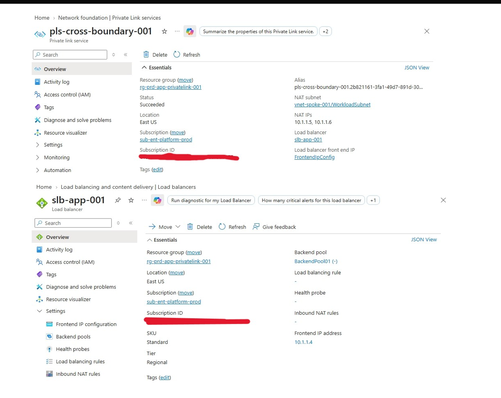
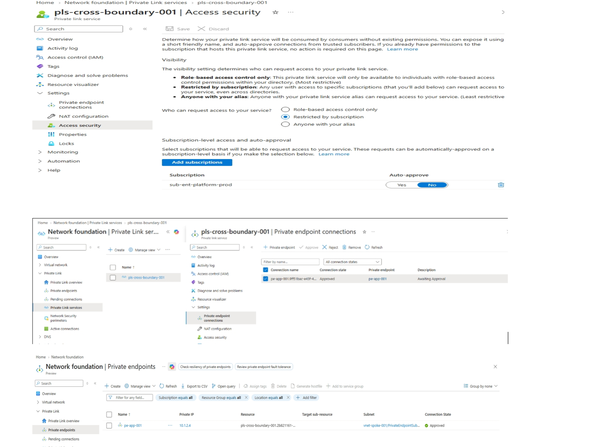

# Phase 4: Cross-Boundary Private Link Service & Endpoint Isolation

> **Phase Objective:** Isolate backend application workloads by exposing service endpoints across boundary limits using Azure Private Link Service (PLS) and Private Endpoints (PE) with manual RBAC authorization workflows and dedicated NAT subnets.

---

## 📋 Phase Overview

Phase 4 completes the **Data Plane & Service Isolation Layer** for the Hub-and-Spoke architecture. Rather than relying on traditional virtual network peering or direct routed paths for sensitive application tiers, backend services are exposed strictly through an Internal Load Balancer (ILB) attached to a Private Link Service (`pls-cross-boundary-001`). Access is granted across boundaries to `pe-app-001` via a controlled, manual approval connection lifecycle.

---

## ⚡ Key Technical Deliverables & Specifications

- **Target Region:** `eastus`
- **Subscription Scope:** `sub-ent-platform-prod` (`Sub-id`)
- **Backend Virtual Network:** `vnet-spoke-app-001` (`10.1.0.0/16`)
- **Internal Load Balancer (ILB):**
  - **Resource Name:** `slb-app-001`
  - **Front-end IP Address:** `10.1.1.4`
  - **Subnet Placement:** `WorkloadSubnet` (`10.1.1.0/24`)
- **Private Link Service (PLS):**
  - **Resource Name:** `pls-cross-boundary-001`
  - **Target Front-end IP Configuration:** `slb-app-001` (`10.1.1.4`)
  - **NAT Subnet:** `PlsNatSubnet` (`10.1.3.0/24`) inside `vnet-spoke-app-001`
  - **Visibility Setting:** Restricted / Explicit Subscription Authorization
- **Private Endpoint (PE):**
  - **Resource Name:** `pe-app-001`
  - **Assigned IP Address:** `10.1.2.4`
  - **Subnet Placement:** `PrivateEndpointSubnet` (`10.1.2.0/24`) inside `vnet-spoke-app-001`
  - **Connection State:** Approved (Manual approval workflow completed)

---

## 🏗 Architecture Topology & CIDR Breakdown

| Resource Name | Type | IP Address / Prefix | Subnet | Resource Group |
|---|---|---|---|---|
| `slb-app-001` | Internal Load Balancer | `10.1.1.4` | `WorkloadSubnet` (`10.1.1.0/24`) | `rg-prd-app-privatelink-001` |
| `pls-cross-boundary-001` | Private Link Service | Dynamic NAT (`10.1.3.x`) | `PlsNatSubnet` (`10.1.3.0/24`) | `rg-prd-app-privatelink-001` |
| `pe-app-001` | Private Endpoint | `10.1.2.4` | `PrivateEndpointSubnet` (`10.1.2.0/24`) | `rg-prd-app-privatelink-001` |

---

## 🚀 Implementation Steps

### 1. Internal Load Balancer (`slb-app-001`) Provisioning
Deployed an internal, standard SKU load balancer in `WorkloadSubnet` (`10.1.1.0/24`) with static private IP `10.1.1.4` to serve as the backend service entry point.

### 2. Private Link Service (`pls-cross-boundary-001`) Configuration
Configured `pls-cross-boundary-001` attached to `slb-app-001`. Provisioned dedicated IP allocation in `PlsNatSubnet` (`10.1.3.0/24`) to handle Source NAT (SNAT) translation for inbound traffic originating from external private endpoints. Direct access visibility was locked down to authorized subscriptions.

### 3. Private Endpoint (`pe-app-001`) Deployment & Approval Workflow
Created `pe-app-001` in `PrivateEndpointSubnet` (`10.1.2.0/24`), requesting direct connection to `pls-cross-boundary-001` via its resource URI/alias. 

Because cross-boundary isolation is enforced, the connection requested an explicit approval state:
1. Connection request submitted in `Pending` status.
2. Verified connection request details on `pls-cross-boundary-001`.
3. Executed explicit approval step to transition `pe-app-001` to `Approved` state.

---

## 🔬 Evidence & Verification

### 1. Private Link Service Overview & NAT Configuration
Verification of `pls-cross-boundary-001` bound to backend frontend IP `10.1.1.4` (`slb-app-001`) with dedicated NAT Subnet `10.1.3.0/24`.




### 2. Private Endpoint Connection State Verification
Verification that `pe-app-001` (`10.1.2.4`) in `PrivateEndpointSubnet` (`10.1.2.0/24`) has successfully transitioned to `Approved`.




### 3. Connection Verification Script Execution
Executed connectivity checks using PowerShell/Azure CLI to validate target service resolution through the Private Endpoint IP:

```powershell
# Verify Private Endpoint IP Allocation
Get-AzPrivateEndpoint -ResourceGroupName "rg-prd-app-privatelink-001" -Name "pe-app-001" | 
  Select-Object -ExpandProperty NetworkInterfaces | 
  Get-AzNetworkInterface | 
  Select-Object -ExpandProperty IpConfigurations | 
  Format-Table PrivateIpAddress, Name

# Verify PLS Connection State
Get-AzPrivateLinkService -ResourceGroupName "rg-prd-app-privatelink-001" -Name "pls-cross-boundary-001" | 
  Select-Object -ExpandProperty PrivateEndpointConnections | 
  Format-Table Name, PrivateEndpointConnectionStatus
```

---

## 💡 Lessons Learned & Troubleshooting

- **Dedicated NAT Subnet Allocation:** A Private Link Service requires at least one dedicated subnet for SNAT IP allocation (`PlsNatSubnet`). These subnets cannot be reused for regular workload VM deployments.
- **Network Security Group (NSG) Policies:** `PrivateEndpointNetworkPolicies` and `PrivateLinkServiceNetworkPolicies` must be explicitly managed on the subnets to ensure traffic flow is not unexpectedly blocked by default NSG rules.
- **Cross-Tenant / Boundary Approvals:** When Private Endpoints request connections to Private Link Services across subscription or tenant boundaries, automatic approval is disabled. An explicit administrative action or automated pipeline step must approve the connection alias.