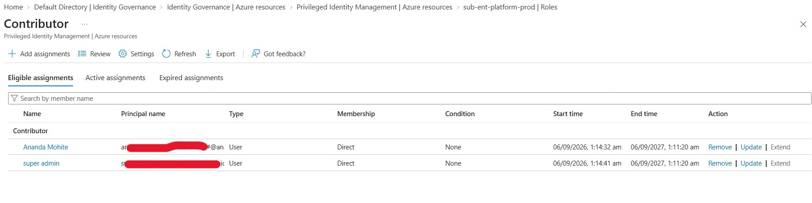
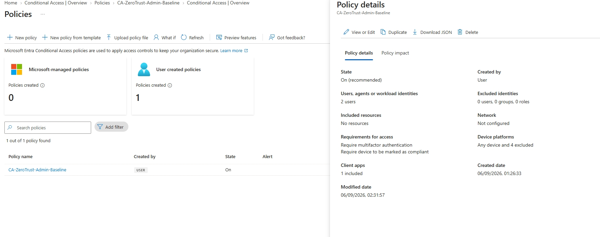

# Phase 5: Identity Governance & Access Hardening and Final Validation

> **Phase Objective:** Enforce Zero-Trust privileged access controls across the platform subscription, mandate multi-factor authentication (MFA) and compliant location policies, and conduct end-to-end operational validation across the entire landing zone fabric.

---

## 📋 Phase Overview

Phase 5 completes the platform landing zone by securing the management and control planes. Using **Microsoft Entra Privileged Identity Management (PIM)**, permanent administrator permissions are eliminated in favor of just-in-time (JIT) eligible role activations. Access to management interfaces is governed by the **Conditional Access Baseline Policy** (`CA-ZeroTrust-Admin-Baseline`), requiring strong MFA and strict session controls.

---

## ⚡ Key Technical Specifications

- **Target Subscription Scope:** `sub-ent-platform-prod` (`Sub-id`)
- **Target Resource Group:** `rg-prd-app-privatelink-001` / `rg-prd-hub-network-001`
- **Entra PIM Role Assignment:**
  - **Role:** `Contributor`
  - **Assignment Type:** Eligible (Just-In-Time activation required)
  - **Max Activation Duration:** 8 Hours (requires business justification and MFA)
- **Conditional Access Policy:**
  - **Policy Name:** `CA-ZeroTrust-Admin-Baseline`
  - **Target Apps:** Azure Management (`797f1113-7002-4b15-af92-96691741362e`)
  - **Grant Controls:** Require Multi-Factor Authentication (MFA) & Require Authentication Strength
- **Network Validation Targets:**
  - **Azure Route Server:** `route-server-hub-001` (`10.0.2.4`, `10.0.2.5`)
  - **Linux NVA Peer:** `peer-linux-vm` (`10.0.1.4`, ASN `65001`)
  - **Internal Load Balancer:** `slb-app-001` (`10.1.1.4`)
  - **Private Endpoint:** `pe-app-001` (`10.1.2.4`)

---

## 🏗️ Phase 5 Governance Architecture

| Control Layer | Policy / Role Name | Scope / Target | Enforcement / Grant Mechanism |
|---|---|---|---|
| **Identity Governance** | Entra PIM | `sub-ent-platform-prod` | Eligible `Contributor` JIT Role Activation |
| **Access Security** | `CA-ZeroTrust-Admin-Baseline` | Azure Portal & Management API | Require Strong MFA + Session Sign-in Frequency |
| **Control Plane** | `route-server-hub-001` | `vnet-hub-001` / ASN `65515` | Dynamic eBGP Peering via FRRouting (`peer-linux-vm`) |
| **Data Plane Isolation** | `pls-cross-boundary-001` | `slb-app-001` (`10.1.1.4`) | Manual Approval Endpoint Isolation (`pe-app-001` @ `10.1.2.4`) |

---

## 🛠️ Step-by-Step Implementation

### 1. Entra PIM Eligible Assignment Provisioning

Configured Just-In-Time role activation on subscription `sub-ent-platform-prod` (`41a2b403-5b13-4a58-8cc0-c3ec75dba78a`) to eliminate standing privileged access:

```powershell
# Assign Eligible Contributor Role at Subscription Scope
$subId = "/subscriptions/41a2b403-5b13-4a58-8cc0-c3ec75dba78a"
$roleDef = Get-AzRoleDefinition -Name "Contributor"

New-AzRoleEligibilityScheduleRequest `
  -Name (New-Guid) `
  -Scope $subId `
  -PrincipalId "<admin-object-id>" `
  -RoleDefinitionId $roleDef.Id `
  -RequestType "AdminAssign"
```

### 2. Conditional Access Enforcement (`CA-ZeroTrust-Admin-Baseline`)

Enforced administrative sign-in policies targeting Microsoft Azure Management endpoints:

- Required phishing-resistant or strong MFA for all portal and PowerShell/CLI connections.
- Applied explicit block rules for non-compliant legacy authentication protocols.

---

## 🔬 Evidence & Validation Matrix

| Resource / Control | Verification Description | Evidence Link |
|---|---|---|
| **Entra PIM** | Eligible Contributor assignment on `sub-ent-platform-prod` | `docs/images/phase-5/01-pim-eligible-assignments.png` |
| **Conditional Access** | `CA-ZeroTrust-Admin-Baseline` policy enforcement details | `docs/images/phase-5/02-conditional-access-policy.png` |

---

### 1. Entra PIM Eligible Assignment Verification

Verification of active eligible `Contributor` assignment configured for the enterprise platform subscription (`sub-ent-platform-prod`).



---

### 2. Conditional Access Policy Enforcement

Verification of `CA-ZeroTrust-Admin-Baseline` conditional access settings enforcing MFA controls for administrative management contexts.



---

## 🧪 Comprehensive End-to-End Landing Zone Validation

To validate the entire multi-phase landing zone implementation (Phases 1 through 5), execute the following diagnostic tests:

### 1. Check Dynamic BGP Route Propagation (Phase 3)

Verify from `peer-linux-vm` (`10.0.1.4`) that BGP sessions with `route-server-hub-001` (`10.0.2.4`, `10.0.2.5`) are established and advertising `10.1.1.0/24`:

```bash
# Verify BGP summary in FRRouting
sudo vtysh -c "show ip bgp summary"

# Verify advertised prefix in FRR table
sudo vtysh -c "show ip bgp"
```

### 2. Validate Learned Routes in Azure Route Server (Phase 3)

Run via Cloud Shell / Azure PowerShell to confirm `route-server-hub-001` learned `10.1.1.0/24` from `peer-linux-vm`:

```powershell
Get-AzRouteServerPeerLearnedRoute `
  -ResourceGroupName "rg-prd-hub-network-001" `
  -RouteServerName "route-server-hub-001" `
  -PeerName "peer-linux-vm" | Format-Table
```

### 3. Verify Private Endpoint Connectivity & Resolution (Phase 4)

Run from a Spoke VM inside `vnet-spoke-001` to test access to the isolated service via `pe-app-001` (`10.1.2.4`) connected to `slb-app-001` (`10.1.1.4`):

```bash
# 1. Test TCP 80 connection to Private Endpoint IP
nc -zv 10.1.2.4 80

# 2. Test HTTP response through Private Link Service NAT (10.1.1.5 / 10.1.1.6)
curl -I http://10.1.2.4/
```

### 4. Audit Privileged Access Log (Phase 5)

Run via Azure PowerShell to inspect PIM activation history and ensure zero permanent `Owner`/`Contributor` assignments exist on `sub-ent-platform-prod`:

```powershell
# Audit Active vs Eligible Role Assignments
Get-AzRoleAssignment -Scope "/subscriptions/41a2b403-5b13-4a58-8cc0-c3ec75dba78a" | 
  Select-Object DisplayName, RoleDefinitionName, Scope | Format-Table
```

---

## 💡 Key Architectural Takeaways

1. **Least-Privilege & JIT Administration:** Standing administrator access presents unnecessary risk. Implementing Entra PIM eligible roles mandates time-bound activations and explicit justification trails for audit compliance.
2. **Identity as the First Line of Defense:** Combining PIM with `CA-ZeroTrust-Admin-Baseline` guarantees that even activated privileges cannot be leveraged without meeting rigorous MFA criteria.
3. **End-to-End Control and Data Plane Separation:** Dynamic control plane routing via BGP (`route-server-hub-001` + `peer-linux-vm`) operates independently from isolated backend data planes (`pls-cross-boundary-001` + `pe-app-001`), keeping workload traffic segmented and secure.